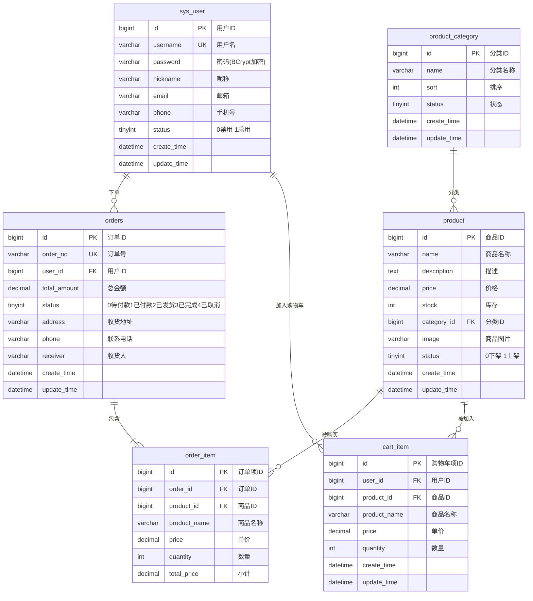

# 电商平台管理系统

全栈电商平台，包含 **管理后台（Web）**、**用户端（Web SPA）**  和 **微信小程序** 三个前端，后端基于 Spring Boot 3.2 + MyBatis-Plus + Spring Security + JWT + Redis 构建。

## 技术架构

```
┌─────────────────────────────────────────────────────────┐
│                      前端层                              │
│  管理后台 (Vue3+ElementPlus)    用户端 (Vue3)   小程序 (Uni-app) │
└──────────────────────┬──────────────────────────────────┘
                       │ HTTP/REST
┌──────────────────────▼──────────────────────────────────┐
│                    后端层 (Spring Boot)                   │
│  ┌──────────┐ ┌──────────┐ ┌──────────┐ ┌──────────┐   │
│  │ Security │ │    JWT   │ │   Redis  │ │  Druid   │   │
│  │  Filter  │ │   Auth   │ │  Cache   │ │  Pool    │   │
│  └──────────┘ └──────────┘ └──────────┘ └──────────┘   │
│  ┌──────────────────────────────────────────────────┐   │
│  │         MyBatis-Plus (ORM + 分页)                │   │
│  └──────────────────────────────────────────────────┘   │
└──────────────────────┬──────────────────────────────────┘
                       │
┌──────────────────────▼──────────────────────────────────┐
│                    数据层                                │
│          MySQL（生产） / H2（开发） + Redis               │
└─────────────────────────────────────────────────────────┘
```

## 技术栈

| 层级 | 技术 | 版本 |
|------|------|------|
| 后端框架 | Spring Boot | 3.2.0 |
| JDK | Java | 21 |
| ORM | MyBatis-Plus | 3.5.5 |
| 安全认证 | Spring Security + JWT (java-jwt) | 4.4.0 |
| 数据库 | H2（开发）/ MySQL | — |
| 连接池 | Druid | 1.2.20 |
| 缓存 | Redis + Spring Data Redis | — |
| 管理后台 | Vue 3 + Element Plus + Pinia + Vite | 3.x |
| 用户端 | Vue 3 + Vite | 3.x |
| 小程序 | Uni-app (Vue 3) | 3.x |

## 项目结构

```
├── backend/
│   └── src/main/java/com/example/ecommerce/
│       ├── Application.java               # Spring Boot 启动入口
│       ├── common/
│       │   ├── Result.java                # 统一响应体 {code, msg, data}
│       │   └── PageResult.java            # 分页结果封装
│       ├── config/
│       │   ├── SecurityConfig.java         # Spring Security 无状态配置
│       │   ├── MybatisPlusConfig.java      # MyBatis-Plus 分页插件
│       │   ├── RedisConfig.java            # Redis 序列化配置
│       │   └── WebConfig.java              # CORS 跨域配置
│       ├── controller/
│       │   ├── ProductController.java      # 商品管理
│       │   ├── CategoryController.java     # 分类管理
│       │   ├── OrderController.java        # 订单管理
│       │   ├── CartController.java         # 购物车
│       │   └── UserController.java         # 用户认证
│       ├── dto/                            # 请求/响应 DTO
│       ├── entity/                         # 数据库实体（6 张表）
│       ├── mapper/                         # MyBatis-Plus Mapper 接口
│       ├── service/
│       │   └── impl/                       # 业务逻辑实现
│       └── utils/
│           └── JwtUtils.java               # JWT 生成/校验工具
├── frontend/
│   └── src/
│       ├── views/          # 管理后台页面（Dashboard / 商品 / 分类 / 订单 / 用户）
│       ├── client/         # 用户端页面（首页 / 详情 / 购物车 / 结算 / 订单）
│       ├── router/         # 路由配置（含 JWT 路由守卫）
│       ├── api/            # Axios 请求封装
│       └── layout/         # 页面布局组件
├── uniapp/
│   └── src/pages/          # 首页 / 详情 / 购物车 / 订单 / 用户 / 结算
├── start.bat               # Windows 一键启动
├── start.sh                # Linux/macOS 一键启动
└── stop.sh                 # 停止服务
```

## 数据库设计



## API 接口文档

所有接口返回统一格式：`{ code: 200, msg: "success", data: ... }`

### 认证接口

| 方法 | 路径 | 说明 |
|------|------|------|
| POST | `/api/user/login` | 登录，返回 JWT token |
| POST | `/api/user/logout` | 登出，token 置为无效 |
| GET | `/api/user/info` | 获取当前用户信息 |

### 商品接口

| 方法 | 路径 | 说明 |
|------|------|------|
| GET | `/api/product/page?page=1&size=10&name=xxx` | 分页查询商品 |
| GET | `/api/product/list` | 商品列表（不分页） |
| GET | `/api/product/{id}` | 商品详情 |
| POST | `/api/product` | 新增商品 |
| PUT | `/api/product` | 更新商品 |
| DELETE | `/api/product/{id}` | 删除商品 |

### 分类接口

| 方法 | 路径 | 说明 |
|------|------|------|
| GET | `/api/category/list` | 分类列表 |
| GET | `/api/category/{id}` | 分类详情 |
| POST | `/api/category` | 新增分类 |
| PUT | `/api/category` | 更新分类 |
| DELETE | `/api/category/{id}` | 删除分类 |

### 订单接口

| 方法 | 路径 | 说明 |
|------|------|------|
| GET | `/api/order/page?page=1&size=10` | 分页查询订单 |
| GET | `/api/order/{id}` | 订单详情（含订单项） |
| POST | `/api/order` | 创建订单 |
| PUT | `/api/order/{id}/status?status=1` | 更新订单状态 |
| GET | `/api/order/status/options` | 订单状态枚举 |

### 购物车接口

| 方法 | 路径 | 说明 |
|------|------|------|
| GET | `/api/cart/items?userId=1` | 获取购物车列表 |
| POST | `/api/cart/add` | 添加商品到购物车 |
| PUT | `/api/cart/update` | 更新商品数量 |
| DELETE | `/api/cart/delete` | 删除购物车商品 |
| DELETE | `/api/cart/clear` | 清空购物车 |
| GET | `/api/cart/count` | 购物车商品数量 |

## 核心设计

### 认证流程

```
客户端                          服务端
  │                              │
  │  POST /api/user/login        │
  │  {username, password} ──────►│  BCryptPasswordEncoder 校验密码
  │                              │  JwtUtils.generateToken() 生成 Token
  │  {token, userInfo} ◄────────│
  │                              │
  │  GET /api/product/list       │
  │  Authorization: Bearer xxx ─►│  JwtUtils.validateToken() 校验签名
  │  200 {data: [...]} ◄────────│  SecurityFilterChain 放行
  │                              │
  │  POST /api/user/logout       │
  │  Authorization: Bearer xxx ─►│  Token 加入 Redis 黑名单
  │                              │
```

- 基于 Spring Security Filter Chain，关闭 CSRF、禁用 Session，采用 **无状态认证**
- 密码使用 BCrypt 加密存储，JWT 使用 HMAC256 签名
- 退出登录后将 Token 写入 Redis 黑名单

### 统一响应体

```json
{
  "code": 200,
  "msg": "success",
  "data": { ... }
}
```

### 分页

```json
{
  "code": 200,
  "data": {
    "records": [...],
    "total": 50,
    "current": 1,
    "size": 10
  }
}
```

## 快速启动

### 环境要求

- JDK 21+
- Node.js 18+
- Maven 3.8+
- Redis（可选，不启动 Redis 时缓存功能不可用，其余功能正常）

### 一键启动

**Windows：**
```bat
start.bat
```

**Linux / macOS：**
```bash
chmod +x start.sh stop.sh
./start.sh
```

### 手动启动

```bash
# 1. 后端
cd backend
mvn spring-boot:run
# → http://localhost:8081

# 2. 管理后台 + 用户端
cd frontend
npm install
npm run dev
# → http://localhost:5173

# 3. 小程序（可选）
cd uniapp
npm install
npm run dev:h5          # H5 开发
npm run dev:mp-weixin   # 微信小程序开发
```

### 访问入口

| 入口 | 地址 | 说明 |
|------|------|------|
| 管理后台 | http://localhost:5173/dashboard | 管理员登录 |
| 用户端 | http://localhost:5173/client/index | 商城首页 |
| H2 控制台 | http://localhost:8081/h2-console | JDBC URL: `jdbc:h2:mem:example_db` |
| 默认账号 | admin / 123456 | 开发环境 |

## 配置说明

编辑 `backend/src/main/resources/application.yml`：

```yaml
# 开发环境使用 H2 内存数据库，生产环境切换为 MySQL：
# spring:
#   datasource:
#     url: jdbc:mysql://localhost:3306/ecommerce
#     username: root
#     password: your_password
#     driver-class-name: com.mysql.cj.jdbc.Driver

# JWT 配置（生产环境务必修改 secret）
jwt:
  secret: your_secure_key_here
  expiration: 86400000   # 24 小时
```
